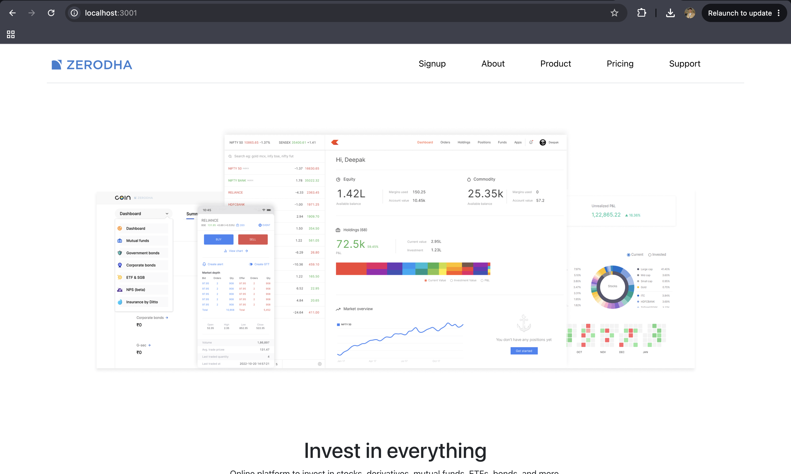
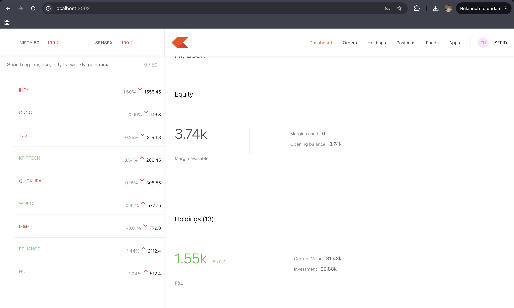
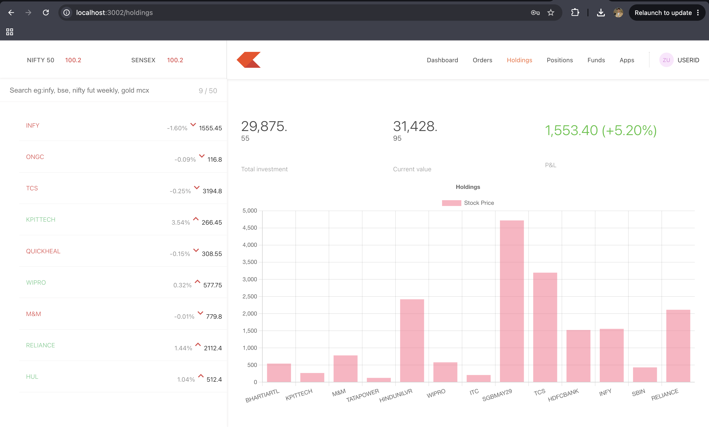
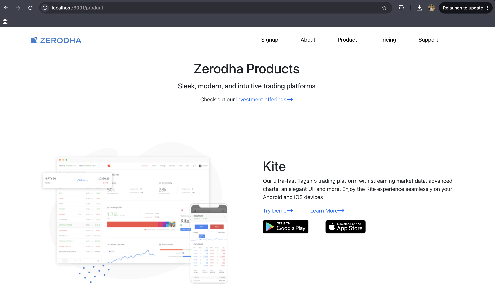
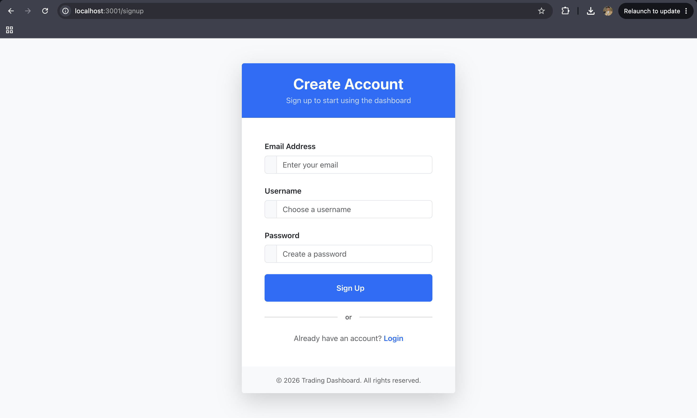

# 📈 Stock Trading Platform 

A full-stack stock trading platform inspired by Zerodha, built with React, Node.js, and Express. The project is split into three independent modules — a public-facing frontend, an admin/user dashboard, and a backend API.

---

## 🗂️ Project Structure

```
ZERODHA/
├── frontend/       → Public landing pages (React)
├── dashboard/      → User trading dashboard (React)
└── backend/        → REST API (Node.js + Express)
```

---

## ✨ Features

### Frontend (Landing Pages)
- Home page with hero section, stats, pricing overview
- About page with team section
- Products page showcasing all Zerodha products
- Pricing page with brokerage details
- Login & Signup pages
- Fully responsive with Bootstrap

### Dashboard
- Protected routes (JWT-based auth)
- User trading interface
- Portfolio and holdings view
- Separate React deployment

### Backend
- User authentication (Login / Signup)
- JWT token generation
- MongoDB database integration
- REST API for frontend &  dashboard

---

## 🛠️ Tech Stack

| Layer      | Technology                        |
|------------|-----------------------------------|
| Frontend   | React, React Router, Bootstrap 5  |
| Dashboard  | React, React Router, Bootstrap 5  |
| Backend    | Node.js, Express.js               |
| Database   | MongoDB (Mongoose)                |
| Auth       | JWT, bcrypt                       |
| HTTP       | Axios                             |
| Alerts     | React Toastify                    |

---

## 🚀 Local Setup

### Prerequisites
- Node.js v18+
- MongoDB running locally or MongoDB Atlas URI
- Git

---

### 1. Clone the repository
```bash
git clone https://github.com/adityaom589/Stock-Trading-Platform
cd Stock-Trading-Platform
```

---

### 2. Backend Setup
```bash
cd backend
npm install
```

Create a `.env` file in the `backend/` folder:
```env
MONGO_URI=your_mongodb_connection_string
JWT_SECRET=your_jwt_secret
PORT=3000
```

Start the backend:
```bash
npm start
```
Backend runs on `http://localhost:3000`

---

### 3. Frontend Setup
```bash
cd frontend
npm install
npm start
```
Frontend runs on `http://localhost:3001`

---

### 4. Dashboard Setup
```bash
cd dashboard
npm install
npm start
```
Dashboard runs on `http://localhost:3002`

---

## 🌐 Deployment

### Backend → Render
1. Go to [render.com](https://render.com) and create a **Web Service**
2. Connect your GitHub repo
3. Set:
   - **Root Directory** → `backend`
   - **Build Command** → `npm install`
   - **Start Command** → `npm start`
4. Add environment variables (`MONGO_URI`, `JWT_SECRET`, `PORT`)
5. Deploy → get URL like `https://stock-trading-platform-backend-3svr.onrender.com`

---

### Frontend → Vercel
```bash
cd frontend
vercel --prod
```
Gets deployed to `stock-trading-platform-eta.vercel.app`

---

### Dashboard → Vercel
```bash
cd dashboard
vercel --prod
```
Gets deployed to `stock-trading-platform-nfb3.vercel.app`

---

## 🔗 Environment Variables

### Backend `.env`
```env
MONGO_URI=your_mongodb_uri
JWT_SECRET=your_secret_key
PORT=3000
```

### Frontend (update URLs in Login.js)
```
BACKEND_URL=https://stock-trading-platform-backend-3svr.onrender.com
DASHBOARD_URL=stock-trading-platform-nfb3.vercel.app
```

---

## 🔒 Auth Flow

1. User logs in via `/login` on the frontend
2. Backend validates credentials and returns a JWT token
3. Frontend redirects to dashboard with token in URL: `/dashboard?token=...`
4. Dashboard stores token in `localStorage` and protects routes

---

## 📁 Frontend Pages

| Route       | Component       |
|-------------|-----------------|
| `/`         | HomePage        |
| `/about`    | AboutPage       |
| `/product`  | ProductsPage    |
| `/pricing`  | PricingPage     |
| `/support`  | SupportPage     |
| `/login`    | Login           |
| `/signup`   | Signup          |
| `*`         | NotFound        |

---
## 📸 Screenshots
 
### 🏠 Home Page

 
### 📊 Dashboard

 
### 📈 Holdings

 
### 💰 Pricing
 

### 💰 Pricing

 
### 📝 Signup

 
---
## 👤 Author

**Aditya Maurya**  
GitHub: [@adityaom589](https://github.com/adityaom589)

---

